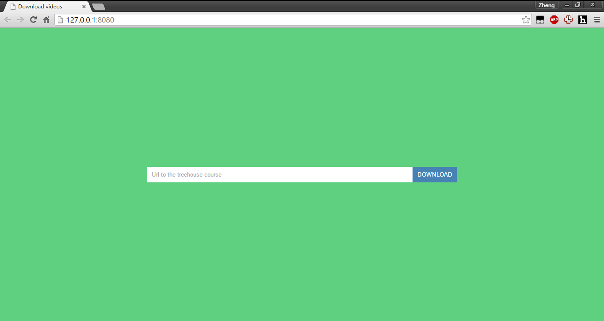

#Treehouse downloader
This tool will help you download videos from the website www.teamtreehouse.com if you have an active subscription and don't want to use the build in downloader with iTunes.
The application will also create all the folders for you numbering them so you can see all the video's in the correct order.

#How to start
1. Pull the project
``` git clone https://github.com/MakhouT/treehouseDownloader.git ```
2. With Node.js installed ([Node.js website](https://nodejs.org/en/))
3. Open the command prompt/terminal and navigate to the folder where the application is
```cd treehouseDownloader```
4. Type ``` npm install ``` to install all the required packages
5. Run ```node app.js```
6. In a browser browse to http://127.0.0.1:8080/


7. Copy the course download link to download from iTunes and insert it in the input of the application, this link should start with 'itpc' and should end with you token corresponding to your account
for example
```
    itpc://teamtreehouse.com/library/build-an-interactive-story-app.rss?feed_token=xxxxxxxx-b326-4ada-8ce4-ca456d6axxxx
```
8. Press download and have some patience until the video's are downloaded.


<br/>
It should create a folder for each chapter of the course and each video inside of it should be numbered so you can watch them in the correct order.
If you find any bugs please report them so I can fix them.


